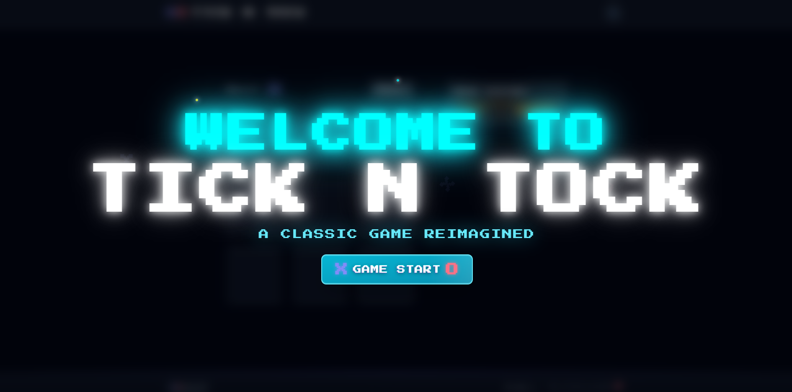
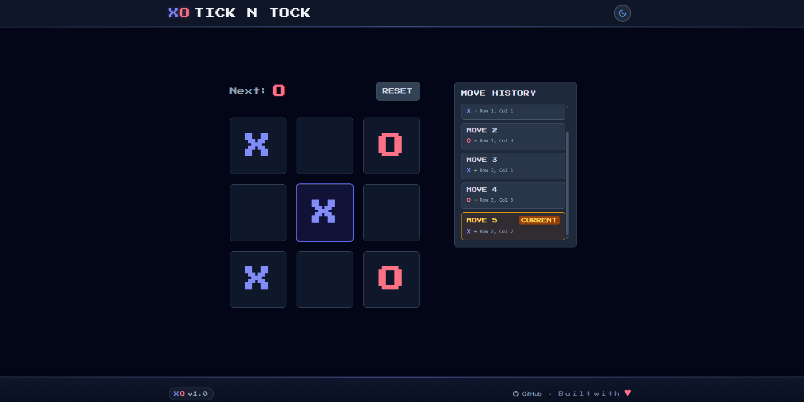

# 🎮 Tick N Tock - Classic Tic-Tac-Toe Game Reimagined

Welcome to **Tick N Tock!** A compact, nostalgic take on the classic Tic‑Tac‑Toe game built with **Next.js**, **Tailwind CSS**, **Shadcn UI**, and **Framer Motion**.

## About

Tick N Tock is a compact web game project I built to sharpen my modern front-end skills while delivering a polished, responsive, and accessible experience. It’s implemented with Next.js, styled using Tailwind CSS and Shadcn UI, animated with Framer Motion, and enhanced by a lightweight WebAudio helper for in-browser sound effects. Additionally, it was an opportunity to learn new techniques for improving SEO, including optimizing metadata, structuring content, and ensuring clean, crawl-friendly code.

## Preview





## Features

- Playable Tic-Tac-Toe (X vs O)
- Move history feature
- Keyboard navigation & other accessibility features
- Fully responsive layout
- Smooth UI transitions & animations
- Theme toggle (light / dark) with system preference support
- Compact in-browser sound effects for moves, wins, draws, and UI actions
- PWA-ready setup: manifest, icons
- Open Graph image + meta setup for social sharing and SEO

## Getting Started

**To view the project:**

1. Clone the repository:

```bash
git clone https://github.com/mattkerbyy/Tick-N-Tock.git
cd front-end
```

2. Install dependencies:

```bash
npm install
# or
# yarn
```

3. Run the development server:

```bash
npm run dev
# Open http://localhost:3000
```

> Recommended: Node.js 18+ for best compatibility with Next.js 14 and newer toolchains.

## Why I Made This

I built Tick N Tock to explore creating a polished web game with modern front-end tools (Next.js, Tailwind, Shadcn UI, Framer Motion), with strong attention to animations, keyboard accessibility, sound effects, and progressive enhancement toward an installable PWA.

---

Thank you for checking out my project! Enjoy the game!
